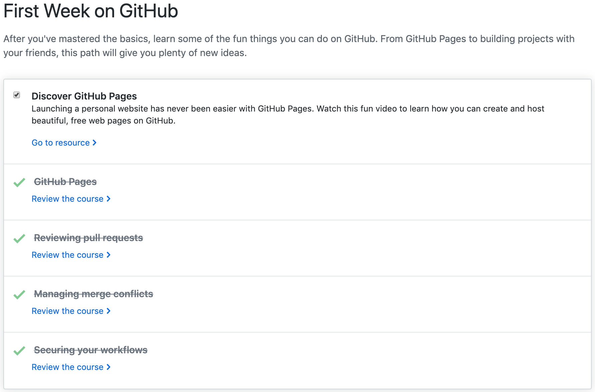

<h2>Welcome!</h2>
<h4>Thanks for taking a look at my online technical resume! This site gives an overview of the skills I've learned this semester.</h4>

<h2><b>Technical Skills</b></h2>

  
<b>GitHub</b>

   
  
Courses completed include:
  <ul>
    <li>Uploading your project to GitHub</li>
    <li>Communicating using Markdown</li>
    <li>GitHub Pages</li>
    <li>Reviewing pull requests</li>
    <li>Managing merge conflicts</li>
    <li>Securing your workflows</li>
  </ul>
  
  

  
<b>Linux</b>

   
  
Skills include:
  <ul>
    <li>Kernel definition and naming conventions</li>
    <li>Basic commands (pwd, cd, ls, cat, history, etc.)</li>
    <li>User permissions (read, write, execute, etc.)</li>
    <li>Input and Output redirection and Piping</li>
    <li>Linux environment variables (PATH, $LANG, etc.)</li>
    <li>Communicating within networks (Ping, FTP, SSH)</li>
    <li>Shell scripting and virtual terminals</li>
  </ul>
  

  
<b>PowerBI</b>

   
  
Data analysis and visualization skills include:
  <ul>
    <li>Manipulating and modeling data</li>
    <li>Graphs, slicers, and conditional formatting</li>
    <li>Dashboards in Power BI Service</li>
    <li>Excel with Power BI</li>
    <li>Managing data content and security</li>
    <li>Creating live connections to servers (through SQL Azure, SQL Database, etc.)</li>
    <li>Power BI mobile phone/tablet compatibility</li>
  </ul>
  

  
<b>PowerShell</b>

   
  
Skills include:
  <ul>
    <li>PowerShell purpose, launching and commmandlets</li>
    <li>Effective use of the help system</li>
    <li>Using the pipeline, object and remote</li>
    <li>Automation</li>
    <li>Basic scripting</li>
    <li>DSC architecture (push/pull)</li>
    <li>Configuring servers for deployment</li>
    <li>Common code practices</li>
    <li>DSC and Linux</li>
  </ul>
  
 

  
<b>AWS</b>

   
  
Courses completed include:
  <ul>
    <li>Definition and benefits of cloud computing</li>
    <li>AWS Core Services</li>
    <li>AWS Security</li>
    <li>AWS Architecting</li>
    <li>AWS Pricing and Support</li>
    <li>AWS Product Demonstrations</li>
  </ul>
  

  

  
<b>Salesforce</b>

   
  
Courses completed include:
  <ul>
    <li>Salesforce Platform Basics</li>
    <li>Data Modeling and Management</li>
    <li>Lightning Experience Customization</li>
    <li>Salesforce Mobile App Customization</li>
    <li>Reports & Dashboards for Lightning Experience</li>
  </ul>
  
 

