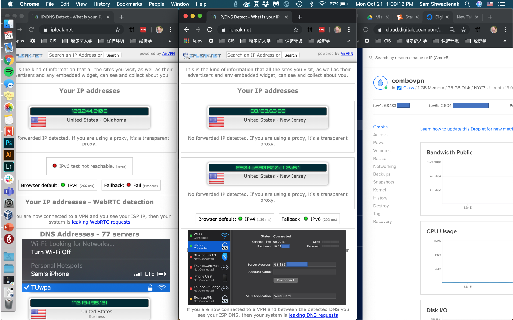
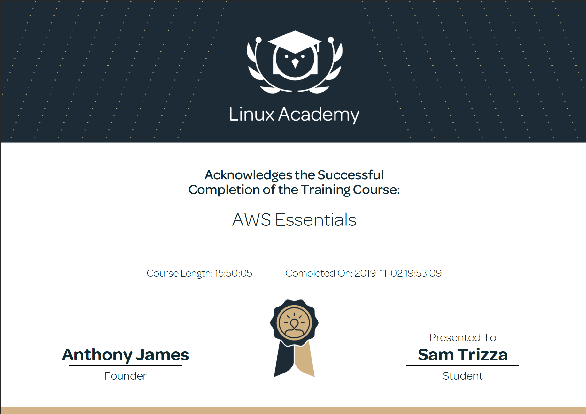
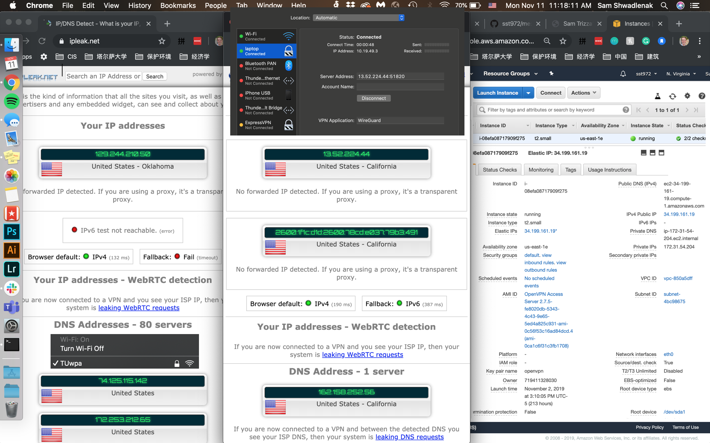
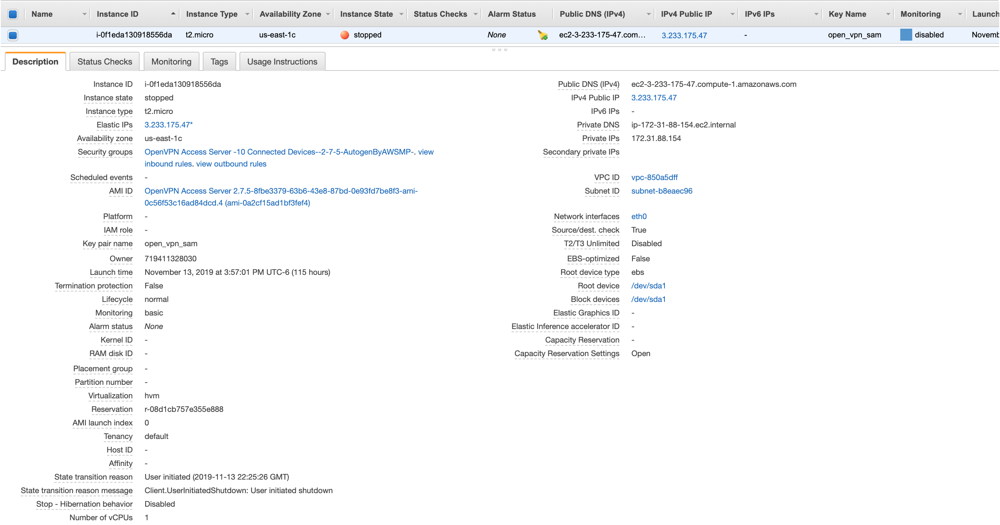
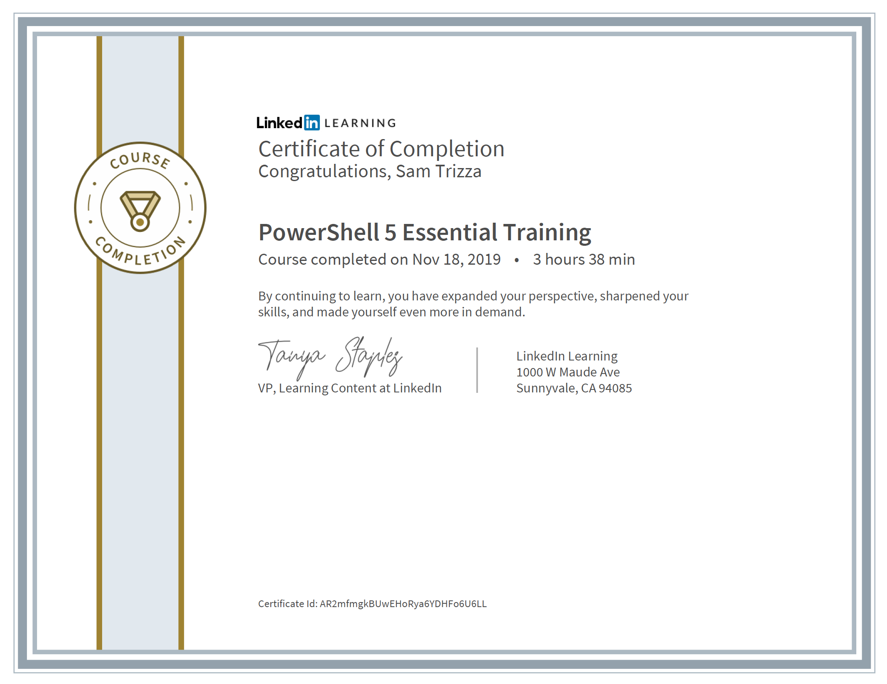
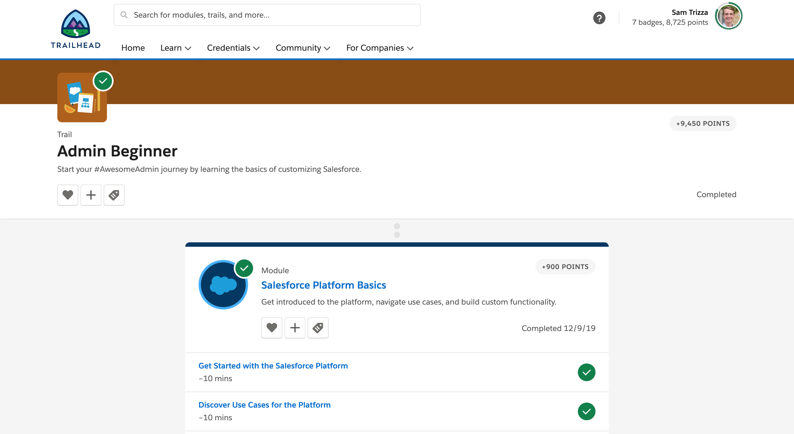

<h2>Welcome!</h2>
<h4>Thanks for taking a look at my online technical resume! This site gives an overview of the skills I've learned this semester, fall 2019.</h4>

<h2><b>Technical Skills</b></h2>

  
<b>GitHub</b>

   
  
Through this training, I learned basic GitHub operations and best practices around building projects with others and communicating with developers, from pull requests to master merges. Github is a main resource for teams working on large, complex systems and projects. This resume was part of the training and is hosted on GitHub with Markdown and YAML. Sections completed include:
  <ul>
    <li>Communicating using Markdown</li>
    <li>Uploading your project to GitHub</li>
    <li>GitHub Pages</li>
    <li>Reviewing pull requests</li>
    <li>Managing merge conflicts</li>
    <li>Securing your workflows</li>
  </ul>
  
  
  

  
<b>Power BI</b>

   
  
I completed the Analyzing and Visualizing Data with Power BI course on <a href = "https://courses.edx.org/courses/course-v1:Microsoft+DAT207x+2T2019/course/">edX.org</a>. Power BI is a cloud-based analytics tool with various components to help business analysts and decision makers. Data in Power BI also updates automatically. In this course I learned best practices on modeling various data types, creating strategic dashboards, and integrating outside tools into Power BI. This course, coupled with an example project, allowed me to understand the uses of Power BI as an overall communication tool – communicating business status, needs, and histories. Topics included in the course are:
  <ul>
    <li>Manipulating and modeling data</li>
    <li>Graphs, slicers, and conditional formatting</li>
    <li>Dashboards in Power BI Service</li>
    <li>Excel with Power BI</li>
    <li>Managing data content and security</li>
    <li>Creating live connections to servers (through SQL Azure, SQL Database, etc.)</li>
    <li>Power BI mobile phone/tablet compatibility</li>
  </ul>
  

  
  
For my project's example dashboard, I used Microsoft's <a href = "https://docs.microsoft.com/en-us/power-bi/sample-human-resources">Human Resources Sample Data</a>. See the project through these outlets: 
  <ul>
    <li><a href = "https://www.youtube.com/watch?v=vzi2quxUv_Y&feature=youtu.be">Video</a></li>
    <li><a href = "https://app.powerbi.com/groups/me/dashboards/b12d0393-faed-48b6-b1bf-e6c067a9527b?ctid=d4ff013c-62b7-4167-924f-5bd93e8202d3">Live Dashboard</a></li>
  </ul>
  
  

  
<b>Linux</b>

   
  
I completed Linux Academy's <a href = "https://linuxacademy.com/cp/modules/view/id/346">LPI Linux Essentials Certification</a>. I learned the structure of the Linux system, how to run commands on the command line, and practical security implications. With no prior Linux understanding, this course gave me a great first understanding of Linux and overview of open-source platforms. The course includes sections on:
  <ul>
    <li>Kernel definition and naming conventions</li>
    <li>Basic commands (pwd, cd, ls, cat, history, etc.)</li>
    <li>User permissions (read, write, execute, etc.)</li>
    <li>Input and Output redirection and Piping</li>
    <li>Linux environment variables (PATH, $LANG, etc.)</li>
    <li>Communicating within networks (Ping, FTP, SSH)</li>
    <li>Shell scripting and virtual terminals</li>
  </ul>
  
  
  

  
I also downloaded VirtualBox to create a virtual machine that runs Ubuntu using these <a href = "https://sal-a.github.io/vbox-ubuntu/#2-download-an-iso-file-for-ubuntu-from-httpsubuntucomdownloaddesktop">instructions</a>. On this VM, I set up my own AlgoVPN using these <a href = "https://github.com/trailofbits/algo">instructions</a>. This screenshot displays (left to right) my host IP address, AlgoVPN IP address, and DigitalOcean droplet:
  
  

  
<b>AWS</b>

   
  
I completed Linux Academy's <a href = "https://linuxacademy.com/cp/modules/view/id/241">AWS Essentials Course</a>, giving me practice in the AWS console and experience in a few tools and services. AWS has an enormous range of abilities and I was introduced to several core services, but I dove into IAM and EC2 with the VPN example at the bottom. The course utilized <a href = "https://interactive.linuxacademy.com/diagrams/ProjectOmega2.html">Project Omega</a> as the example for learning. The course includes modules on:
  <ul>
    <li>Identity and Access Management (IAM)</li>
    <li>Virtual Private Cloud (VPC)</li>
    <li>Elastic Cloud Compute (EC2)</li>
    <li>Storage Services: S3, Buckets and Objects</li>
    <li>Databases: RDS and DynamoDB Basics</li>
    <li>Simple Notification Service (SNS)</li>
    <li>Management Tools: CloudWatch and CloudTrail</li>
    <li>Elastic Load Balancer (ELB), Auto Scaling, Route 53</li>
    <li>Serverless Compute: Lambda</li>
  </ul>
  
  

  

  I configured AlgoVPN on Amazon EC2 using these <a href = "https://github.com/trailofbits/algo">instructions</a>. I also configured OpenVPN on Amazon EC2 using these <a href = "https://openvpn.net/vpn-server-resources/amazon-web-services-ec2-byol-appliance-quick-start-guide/">instructions</a>.
  
  
  

  
<b>PowerShell</b>

   
  
I was first exposed to PowerShell through the LinkedIn Learning course <a href = "https://www.linkedin.com/learning/powershell-5-essential-training/next-steps">PowerShell 5 Essential Training</a>. This course showed me how to use PowerShell and seek help on the command line if needed. This course also taught me about scripting and automation as well as remote management; both highly useful tools in any organization. PowerShell is essential for any Windows systems administrator and this course was a fantastic introduction to the world. It includes sections on:
  <ul>
    <li>PowerShell purpose, launching and commmandlets</li>
    <li>Understanding cmdlet syntax</li>
    <li>Resolving terse commands and discovering commands</li>
    <li>Finding and using local modules</li>
    <li>Working with files, printers, CSVs, and XML in the pipeline</li>
    <li>Selecting, sorting, and filtering object data</li>
    <li>Creating scripts</li>
    <li>Automation tasks</li>
    <li>Using PowerShell remoting</li>
  </ul>
  
  
 

  

  
<b>Salesforce</b>

   
  
I completed the <a href = "https://trailhead.salesforce.com/en/content/learn/trails/force_com_admin_beginner">Admin Beginner</a> cource through Salesforce's Trailhead site. This was my favorite course because Salesforce was the easiest to understand and the content of Salesforce is quite useful. I felt like it was the perfect combination of Power BI and AWS (though that's not 'technically' correct). Salesforce is doing well in the marketplace with their marketing insight tools and abilities in user, data, report, and dashboard management. The course includes units on:
  <ul>
    <li>Salesforce Platform Basics</li>
    <li>Data Modeling and Management</li>
    <li>Lightning Experience Customization</li>
    <li>Salesforce Mobile App Customization</li>
    <li>User Engagement</li>
    <li>Reports & Dashboards for Lightning Experience</li>
  </ul>
  
  
 

