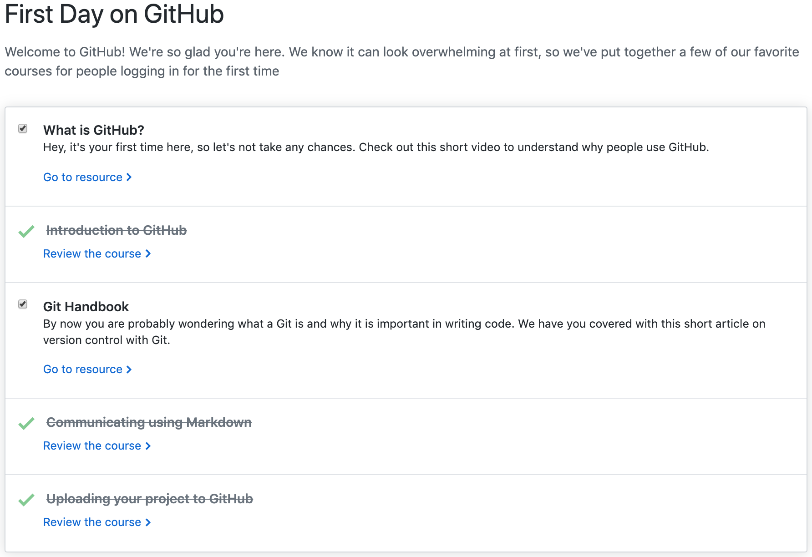
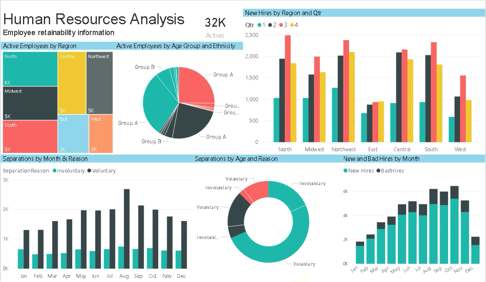
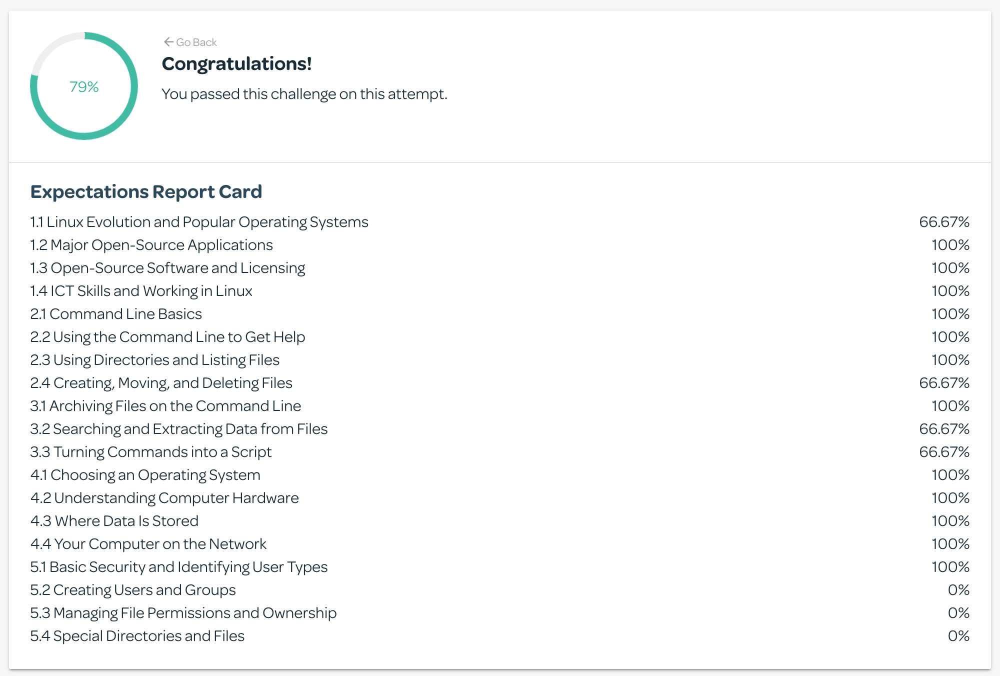
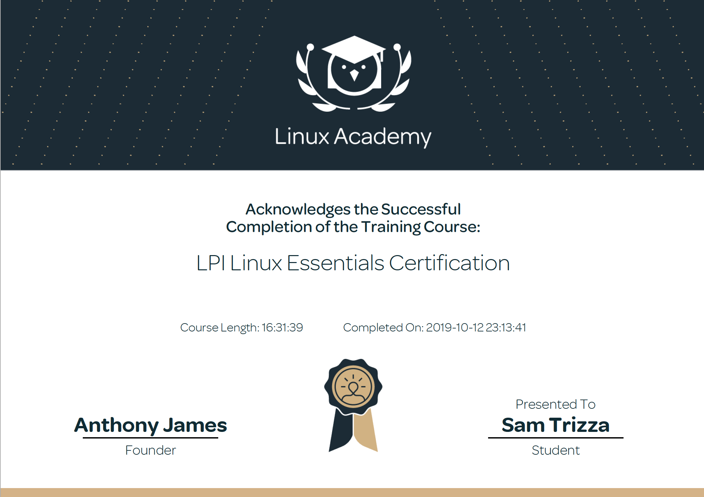

<h2>Welcome!</h2>
<h4>Thanks for taking a look at my online technical resume! This site gives an overview of the skills I've learned this semester.</h4>

<h2><b>Technical Skills</b></h2>

  
<b>GitHub</b>

   
  
Through this training, I learned basic GitHub operations and best practices around building projects with others and communicating with developers, from pull requests to master merges. This resume was part of the training and is hosted on GitHub with Markdown and YAML.
    Courses completed include:
  <ul>
    <li>Communicating using Markdown</li>
    <li>Uploading your project to GitHub</li>
    <li>GitHub Pages</li>
    <li>Reviewing pull requests</li>
    <li>Managing merge conflicts</li>
    <li>Securing your workflows</li>
  </ul>
  
  
  

  
<b>Power BI</b>

   
  
I completed the Analyzing and Visualizing Data with Power BI course on <a href = "https://courses.edx.org/courses/course-v1:Microsoft+DAT207x+2T2019/course/">edX.org</a>. This course, coupled with an example project, allowed me to understand the uses of Power BI as a communication tool. Topics included in the course were:
  <ul>
    <li>Manipulating and modeling data</li>
    <li>Graphs, slicers, and conditional formatting</li>
    <li>Dashboards in Power BI Service</li>
    <li>Excel with Power BI</li>
    <li>Managing data content and security</li>
    <li>Creating live connections to servers (through SQL Azure, SQL Database, etc.)</li>
    <li>Power BI mobile phone/tablet compatibility</li>
  </ul>
  

  
  
For my project's example dashboard, I used Microsoft's <a href = "https://docs.microsoft.com/en-us/power-bi/sample-human-resources">Human Resources Sample Data</a>. See the project through these outlets: 
  <ul>
    <li><a href = "https://www.youtube.com/watch?v=vzi2quxUv_Y&feature=youtu.be">Video</a></li>
    <li><a href = "https://app.powerbi.com/groups/me/dashboards/b12d0393-faed-48b6-b1bf-e6c067a9527b?ctid=d4ff013c-62b7-4167-924f-5bd93e8202d3">Live Dashboard</a></li>
  </ul>
  
  

  
<b>Linux</b>

   
  
I completed Linux Academy's <a href = "https://linuxacademy.com/cp/modules/view/id/346">LPI Linux Essentials Certification</a> which coveres:
  <ul>
    <li>Kernel definition and naming conventions</li>
    <li>Basic commands (pwd, cd, ls, cat, history, etc.)</li>
    <li>User permissions (read, write, execute, etc.)</li>
    <li>Input and Output redirection and Piping</li>
    <li>Linux environment variables (PATH, $LANG, etc.)</li>
    <li>Communicating within networks (Ping, FTP, SSH)</li>
    <li>Shell scripting and virtual terminals</li>
  </ul>
  
  
  

  
<b>PowerShell</b>

   
  
Skills include:
  <ul>
    <li>PowerShell purpose, launching and commmandlets</li>
    <li>Effective use of the help system</li>
    <li>Using the pipeline, object and remote</li>
    <li>Automation</li>
    <li>Basic scripting</li>
    <li>DSC architecture (push/pull)</li>
    <li>Configuring servers for deployment</li>
    <li>Common code practices</li>
    <li>DSC and Linux</li>
  </ul>
  
 

  
<b>AWS</b>

   
  
Courses completed include:
  <ul>
    <li>Definition and benefits of cloud computing</li>
    <li>AWS Core Services</li>
    <li>AWS Security</li>
    <li>AWS Architecting</li>
    <li>AWS Pricing and Support</li>
    <li>AWS Product Demonstrations</li>
  </ul>
  

  

  
<b>Salesforce</b>

   
  
Courses completed include:
  <ul>
    <li>Salesforce Platform Basics</li>
    <li>Data Modeling and Management</li>
    <li>Lightning Experience Customization</li>
    <li>Salesforce Mobile App Customization</li>
    <li>Reports & Dashboards for Lightning Experience</li>
  </ul>
  
 

